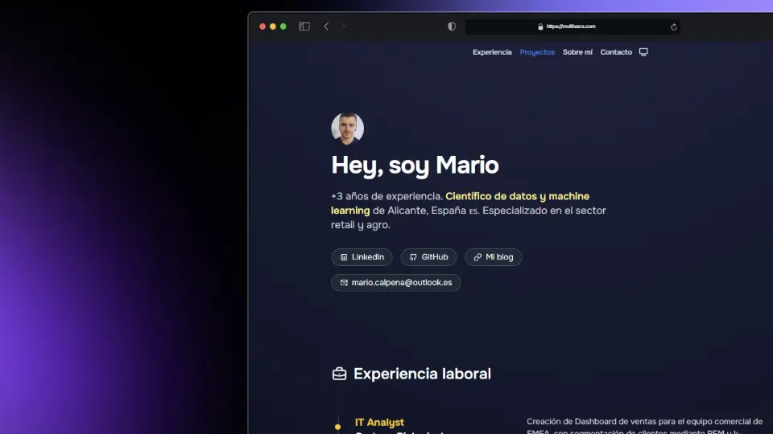

# 👨🏻‍💻 Landing Page con Blog integrado

<div align="center">
<a href="https://multivacs.com/">

</a>
<p></p>
</div>

## What It Has
---

- Página de inicio con introducción, experiencia laboral y proyectos destacados
- Sección de proyectos para porfolio


## Technology Stack
---

**Frontend**:   
**Framework Web**:   


## Quick Setup
---

### Prerequisitos
- npm o pnmp
- Node.js


### Local Development

1. Clonar repo e instalar dependencias con entorno virtual

```bash
git clone <repo-url>
cd multivacs.github.io
pnpm install
```

2. Iniciar servidor en modo desarrollo

```bash
pnpm dev
```

### Production Deployment

1. Compilar el proyecto dentro de la carpeta `dist/`

```bash
pnpm build
```

## 📂 Estructura Proyecto
---

```
multivacs.github.io/
├── public/  # archivos estáticos (favicon, imágenes...)
├── src/                    # app
│   ├── components/         # componentes astro
│   ├── layouts/            # plantillas html
│   └── pages/              # rutas de la página
└── package.json            # archivo de dependencias Node.js
```


## 🙏 Fork

Plantilla adaptada de [midudev](https://github.com/midudev/porfolio.dev/).
